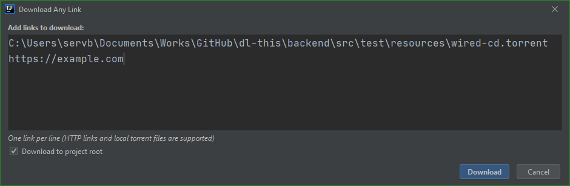
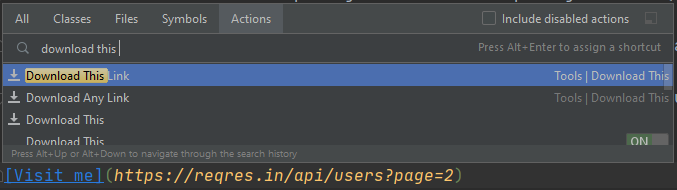

[](https://confluence.jetbrains.com/display/ALL/JetBrains+on+GitHub)

# Download This
A plugin for IDEs to download files.


## Main features
* Three new actions:
    * `Download Any Link` opens a dialog where you can input some links to download.
    
    * `Download This Link` is available when the caret is placed to a link in an editor.
    
    * `Download Selected Link` is available when some text in an editor is selected.
    
* Supported types of links:
    * HTTP/HTTPS.
    * BitTorrent (requires specifying a path to a local `torrent` file).

## Motivation
* Switching to a browser or to a torrent client is slower. IDE should support everything, for example, Git is supported inside IDE.
* Installation of separate applications is slower than installation of the plugin. By separate applications we mean a Torrent Client, but in the future we want to support the syntax of `wget` and `curl` commands that can be missing in Windows, for example.
* If you are using an IDE via remote access which supports only a single application (such as [Projector](https://github.com/JetBrains/projector-server/blob/master/docs/Projector.md)), the plugin seems to be the single visual way to download files from the Internet to the host.

## Installation
Just download a [release](https://github.com/JetBrains/dl-this/releases) and then choose this Zip file in Plugins | Install plugin from disk.

## Running from source
```shell script
./gradlew :plugin:runIde
```

This will open a sandbox-IDE with this plugin installed.

## Building from source
```shell script
./gradlew :plugin:buildPlugin
```

The plugin distribution file will appear in `plugin/build/distributions` dir.

## Many things yet to improve
* Introduce features:
    * Show `Download This Link` and `Download Selected Link` as context actions.
    * An editor with the list of active and finished downloads.
    * Plugin settings (at least for default download dir).
    * Support more ways of torrent downloading:
        * By magnet links.
        * By info hashes.
    * Support parsing of `curl` and `wget` commands.
    * Show download initial status and progress.
    * Allow stopping downloading.
    * Run `reload from disk` automatically after downloads.
* Fix issues:
    * Sometimes when minimizing and maximizing the IDE, the plugin disappears (no idea why).
    * Plugin isn't dynamic (`Plugin DevKit | Plugin descriptor | Plugin.xml dynamic plugin verification` doesn't find any errors, but the IDE asks to restart after deactivation and activation of the plugin).
    * Messages are "hardcoded" (maybe we can use the `bundle` concept, but can't find any guides how to use it).
* Don't use blocking calls (for example, switch to coroutines).
* Add plugin tests.
* Since not only links supported, remove `Link` word from names of actions.

## Similar plugins
[Download Selection](https://plugins.jetbrains.com/plugin/7250-download-selection) provides only an action to download selected link, crashes when a bad link is selected, lacks open-source code, and supports only HTTP.
